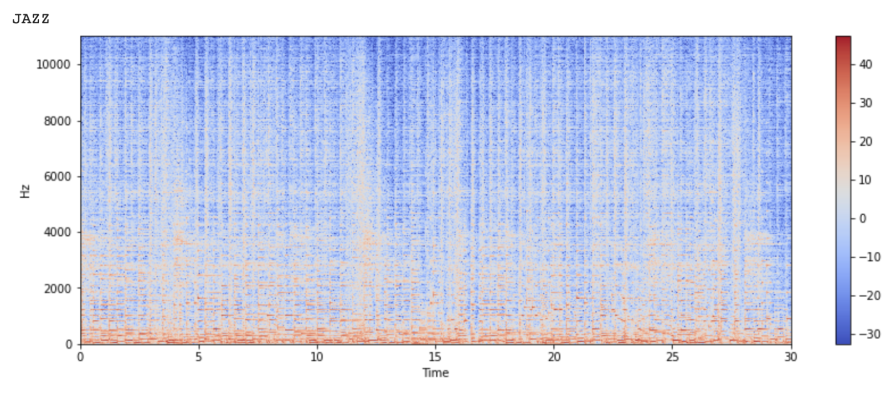

# Music-Genre-Classification
## Introduction
Music genres facilitate the identification of patterns and makes it easier to find music that is most satisfying to our personal taste by exploring more of their favorite music types. Music genres also help companies make recommendations and suggestions that would considerably enhance their customers’ listening enjoyment. Genre helps on organize a large mass of music so that it’s easier to locate and identify a song we don’t know. In this project, we developed a Music Genre Classification using Machine Learning techniques. We first created our dataset but extracting music features from 1000 song using LIBROSA library. Then we used some Classification techniques such as K-nearest Neighbor, Support Vector Machine (SVM), and Logistic Regression.

## Datasets and Features 
We used GTZAN dataset, which provided us 1000 of 30 seconds music clips, a 100-music clip for each genre and each music clip was labeled with its own genre. 
After that we applied Python library, LIBROSA, to visualize and extract features from the music clips and create our own dataset. For visualization, LIBROSA provides Spectrogram which is a visual representation of the spectrum of frequencies of sound or other signals as they vary with time. 
Below are examples of two audios from two different genres.




## Analysis of the dataset
### Analysis of Chromagram and MFCCS
| Algorithms | Chromagram | MFCCs |
| ---------- | ---------- | ----- |
| Logistic Regression | 20% | 47% |
| Linear_SVC | 19% | 41% |
| RBF_SVC | 25% | 49% |
| Poly_SVC | 18% | 45% |
| KNN (Best k value = 3) | 23% | 53% |

The table indiactes that MFCCs has a better performance than Chromagram, which is very obvious by comparing the test accuracy of MFCCs and Chromagrams. The reason might be due to the roles of Chromagram and MFCC. To be specific, according to charts below, the Chromagram is related to 12 pitch classes. These are very common and widely used in all genres. This causes the training model and prediction for the genres to be very low. However, MFCC is vital and it models the human voices and tones, which it is related to musical instrument and human voice, which truly relates to the genres. Consequently, the predictions and accuracy are higher than Chromagram.


## Analysis of the whole dataset
| Algorithms | Training accuracy | Test accuracy |
| ---------- | ---------- | ----- |
| Logistic Regression | 76% | 63% |
| Linear_SVC | 70% | 59% |
| RBF_SVC | 79% | 49% |
| Poly_SVC | 83% | 61% |
| KNN (Best k value = 5) | 78% | 61% |

In order to analyze the training model, we used three algorithms (Logistic Regression, SVC, and KNN) and in the case of SVC, we used three different kernels to train the model, which are similar to the one used to analyze the MFCC and Chromagram. According to the table, we could see that the accuracy for 4 models is quite similar beside the Linear_SVC. Based on the score on training accuracy and test accuracy, we believe that the best approach is Logistic regression, which are 76% and 63% respectively. The table also show that the model has the lowest accuracy, evidently, it is the Linear_SVC with 70% in training accuracy and 57% in test accuracy.

Last but not least, the confusion matrix graphs below represent all the matrix of 4 models. Overall, the accuracy for all the models are not really bad; however, as we explained above, Linear_SVC has the lowest accuracy and based on the Linear_SVC graph, we realize that for the genre, Blues, it mistakenly predicted with different Country. This has an impact on the performance of training model using Linear_SVC kernel in SVC algorithm. Besides, the genre Blues was not the only one mistaken in most of the algorithms with Country genre (8 in RBF_SVC or 6 in Logistic Regression), the Country genre was mistaken with Jazz genre and Polynomial_SVC was affected the most. Overall, the accuracy score for all the algorithms we trained the model is pretty good and it reaches up to 63% in test accuracy in Logistic Regression, comparing to the other algorihms.


# How to use the project
### Clone the respotory
```shell
$ git clone https://github.com/ungc1atwit/Music-Genre-Classification.git
```
Please use Colab or Jupiter to modify the code in Music_Genre_Classification.ipynb and createDatabse.ipynb. 
**Note: if you want to generated features from new dataset (audios file in .wav format), please modify the location in createDatabse.ipynb where you stored the dataset.**

